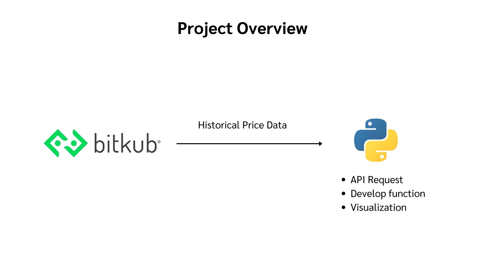
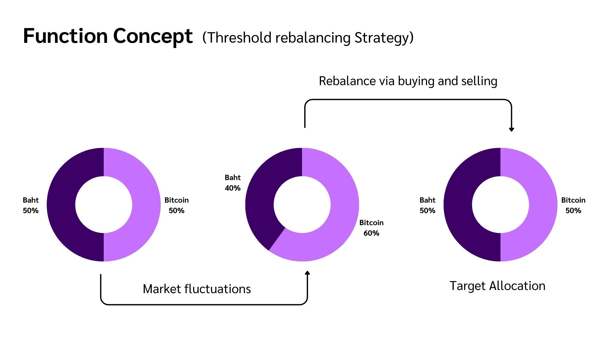
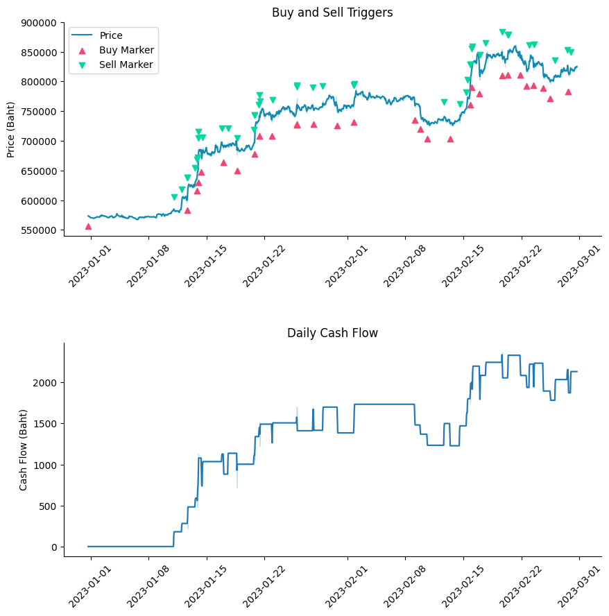

# Financial Backtesting

## Introduction
This project aim to create the backtesting function via Python. The function will be used for simulating and evaluating the performance of a `rebalancing trading strategy` on historical price data.

## Contents
- Project Overview
- API Request
- Develop Backtesting Algorithm
- Visualization

## Project Overview

## API Request
Use  GET method to get historical data from Bitkub public endpoint.

More info about the Bitkub RESTful api: [https://github.com/bitkub/bitkub-official-api-docs/blob/master/restful-api.md](https://github.com/bitkub/bitkub-official-api-docs/blob/master/restful-api.md)

## Develop Backtesting Algorithm

## Visualization
here the one sample of the results 

Final Report - [click here](https://www.canva.com/design/DAFzcCmUMtQ/KcfKCJy8nIVQWXZxZsQiAg/edit?utm_content=DAFzcCmUMtQ&utm_campaign=designshare&utm_medium=link2&utm_source=sharebutton)